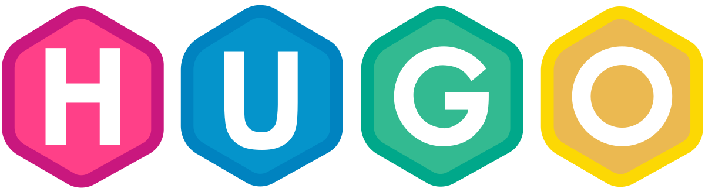
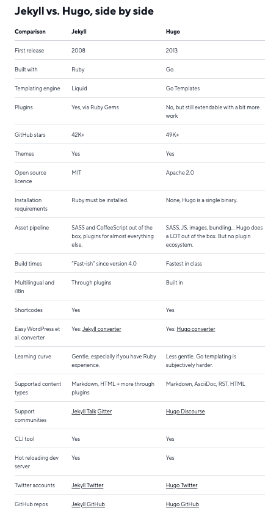

# Institutional Website in Hugo

## What is [Hugo](https://gohugo.io/)? 🤔

Hugo is an open-source static site generator. [Static sites](https://davidwalsh.name/introduction-static-site-generators) take the content, typically stored in flat files rather than databases, apply it against layouts or templates and generate a structure of purely static HTML files that are ready to be delivered to the users.

It is written in Go. [Go](https://go.dev/) is an open-source programming language focused on simplicity, reliability, and efficiency. Go was originally designed at Google in 2007. At the time, Google was growing quickly, and code being used to manage their infrastructure was also growing quickly in both size and complexity. Some Google cloud engineers began to feel that this large and complex codebase was slowing them down. So they decided that they needed a new programming language focused on simplicity and quick performance. Go became an open-source project and was released publicly in 2012. It quickly gained a surprising level of popularity and has become one of the leading modern programming languages.

Hugo is for people building a blog, a company site, a portfolio site, documentation, a single landing page, or a website with thousands of pages.

## Why Hugo? 🥇

[Top static site generators (SSG)](https://medium.com/@ezinneanne/top-ten-popular-static-site-generators-ssg-in-2023-e1894fca6925):

- Hugo - fastest, known for speed
- Jekyll - popular, known for GitHub pages
- Gatsby - for progressive web apps
- Next.js - best app SSG
- Pelican - easier for python developers
- Eleventy - the simplest
- Hexo - lightweight
- Grindsome - easier for vue developers
- Metalsmith - best customisable
- Nuxtjs - easier for vue developers

### Hugo vs Jekyll

Hugo’s popularity seems to be growing at a faster pace than Jekyll’s:

- Search: for “Hugo to Jekyll” in Google, results are all about people switching from Jekyll to Hugo. Hugo even has instructions for a smooth migration from Jekyll to Hugo.
- Github stars: Jekyll (47.6k) vs Hugo (70.3k)
- Trends: [Jekyll](https://trends.builtwith.com/cms/Jekyll) vs [Hugo](https://trends.builtwith.com/cms/Hugo)

 

*Image from 2021*

## How to start a Hugo website? 👩‍💻

- [Quick start](https://gohugo.io/getting-started/quick-start/)
- [Directory structure](https://gohugo.io/getting-started/directory-structure/)
- [Documentation](https://gohugo.io/documentation/)
- [Community](https://discourse.gohugo.io/)
- [GitHub](https://github.com/gohugoio/hugo)

## What are [Themes](https://themes.gohugo.io/)? 🎨

Themes are style and website templates. However, it is still possible to override these styles and templates if you want to. Furthermore, it is possible to create your own themes. The content of the pages is written with Markdown files, however, for specific situations, HTML can be used.

*Hugo also has plenty of themes ready to go right away, but a prebuilt theme probably isn’t going to match your brand’s vision. Most likely, you’re going to want a custom theme, something that affords you fine-grained control over things like color schemes, typography, and UI components.* *[opinion on draft.dev](https://draft.dev/learn/creating-hugo-themes)*